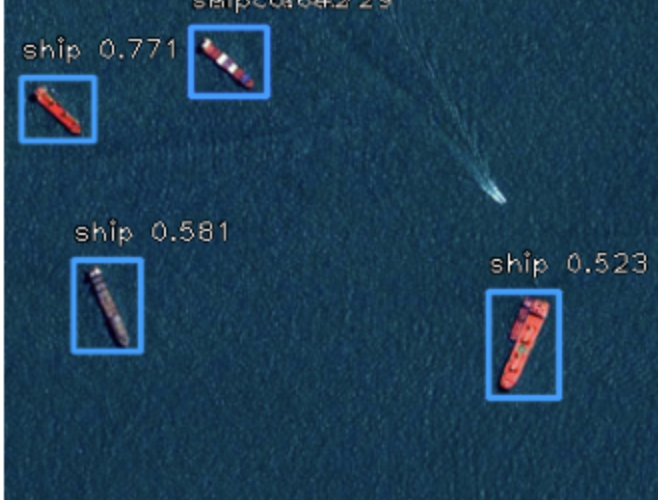
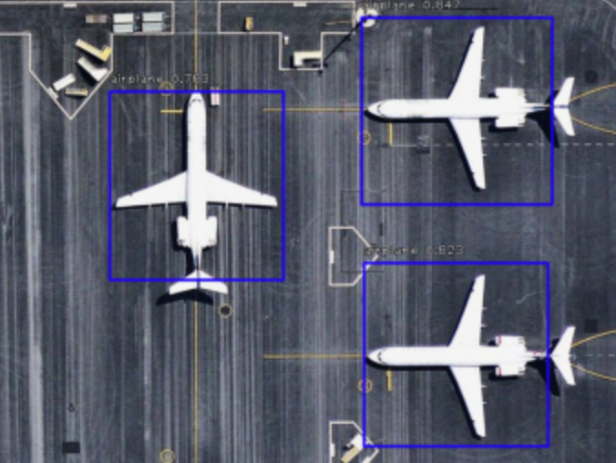

# Geospatial-vehicles-detection

You can access to the dataset via:
[https://www.kaggle.com/datasets/kevin33824/nwpu-vhr-10/data](URL)

or directly download:
[https://www.kaggle.com/datasets/kevin33824/nwpu-vhr-10/data#:~:text=file_download-,Download,-(190%20MB](URL)

